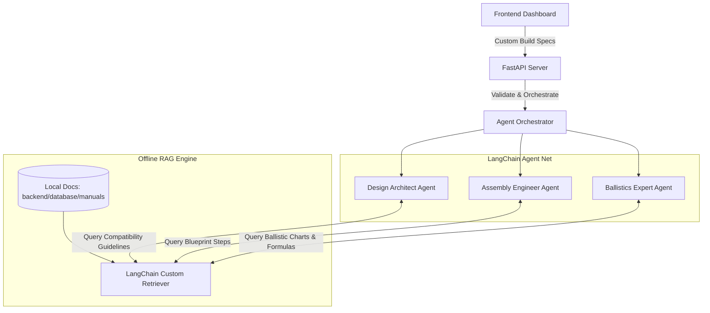

# A.R.M.S. | Autonomous RAG Multi-Agent Weapon Platform

A.R.M.S. is an interactive, tactical weapon customization, step-by-step assembly visualizer, and live-fire shooting range simulator. The application is powered by a multi-agent system built using LangChain core runnables and a local, offline Retrieval-Augmented Generation (RAG) knowledge base.

---

## 📐 Application Architecture

The platform coordinates three specialized agents via a central supervisor to process design requests, retrieve blueprints, and perform ballistics math:



---

## ⚡ Core Features

### 1. 🗃️ Offline Local RAG Pipeline
*   Retrieves tactical information from local weapon manuals (`rifle.txt`, `sniper.txt`, `shotgun.txt`, `machine_gun.txt`, `gatling_gun.txt`).
*   Matches queries against semantic headings using an offline keyword overlap relevance scorer.

### 2. 🤖 LangChain Multi-Agent Collaboration
*   **Design Architect Agent**: Validates component compatibility (warns on dangerous selections like shotgun shells in a rifle chamber, or scope eye risk).
*   **Assembly Engineer Agent**: Structures chronological part installation steps, linking them to visual layers for animation.
*   **Ballistics Expert Agent**: Calculates real-time muzzle velocity, recoil, damage, and range curves using RAG-sourced performance tables.

### 3. 🖥️ Interactive Tactical Console (SPA)
*   **Vector Blueprint customizer**: Generates SVG paths dynamically based on option selects.
*   **Assembly Bay Animation**: Animates separate parts sliding and snapping into place alongside step-by-step mechanical checklist feedback.
*   **2D Canvas Target Shooter**: Includes pointer aiming, recoil bloom, tracers, bullet gravity-based shell ejects, target health states, scoring, and particle hits.
*   **Web Audio Synth**: Generates custom clicks, snaps, cyclic automatic rifle bursts, sniper thumps, and shotgun shell blasts directly through your browser using the Web Audio API (no external asset downloads required!).

---

## 🚀 Quick Setup & Launch

### Prerequisites
*   Python 3.12+ installed on your system.

### Installation
1. Navigate to the project root directory:
   ```bash
   cd /home/ganesh/.gemini/antigravity/scratch/gun-assembly-rag
   ```

2. Run the startup script (it will automatically build your python virtual environment and pull necessary dependencies if missing):
   ```bash
   ./run.sh
   ```

3. Open your browser and navigate to:
   **[http://localhost:8000](http://localhost:8000)**

---

## 🎮 Walkthrough Flow

1.  **Tab 1: Design Specification** - Choose your weapon class (e.g. Assault Rifle, Rotary Cannon). Pick custom calibers, stocks, barrels, and optics. Click **Analyze Design Blueprint** to invoke the Design Architect.
2.  **Tab 2: Assembly Bay** - Once approved, click **Initialize Assembly Cycle** to watch the visual parts glide into place.
3.  **Tab 3: Ballistics Range** - Select your live ammo type, dismiss the instruction overlay, aim with your mouse, and fire! Review telemetry values updated by the Ballistics Agent.
